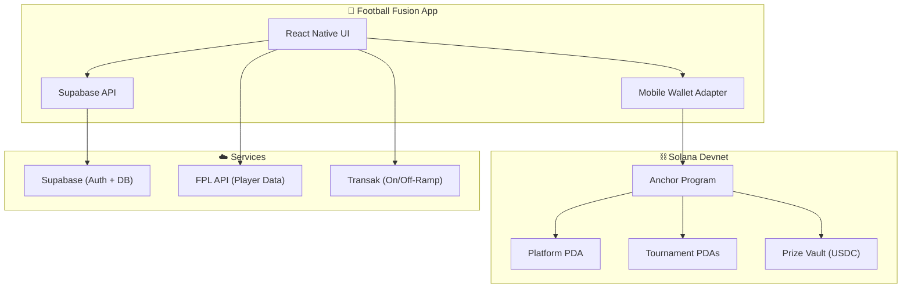

# ⚽ Football Fusion — Pitch Deck

## The Problem

**3.5 billion football fans** worldwide, and **$22B+ fantasy sports market** growing 14% YoY — yet **zero** mobile-native fantasy football apps exist on Solana.

Today's fantasy football suffers from:
- 💸 **Opaque prize pools** — centralized platforms skim 15-20% with no transparency
- 🏦 **Locked funds** — withdrawals take 3-7 days, limited to bank transfers
- 📱 **Desktop-first UX** — existing crypto fantasy apps are web ports, not mobile-native
- 🌍 **Excluded markets** — users in Africa, SEA, and LATAM can't participate due to payment rails

---

## The Solution

**Football Fusion** is a **mobile-first fantasy football dApp** built natively for Solana's Seeker ecosystem.

Users build 15-player squads from real Premier League data, enter USDC-staked tournaments, and compete for transparent, on-chain prize pools — all from their phone.

| Feature | How It Works |
|---------|-------------|
| 🏟️ **Create & Join Tournaments** | On-chain via Anchor program — entry fees go to PDA prize vaults |
| 👥 **Build Fantasy Teams** | 15 real FPL players, 100-point budget, tactical formations |
| 💰 **USDC Prize Pools** | 97% goes to winners (50/30/20 split), 3% platform fee — all verifiable |
| 🔗 **Blockchain Verified** | Every tournament + join transaction on Solana Explorer |
| 💳 **On/Off-Ramp** | Buy USDC with card/bank, withdraw to bank — via Transak integration |
| 📊 **Live Leaderboards** | Real-time rankings synced with FPL gameweek scores |

---

## Why Solana Mobile?

Football Fusion is **built from the ground up** for the Seeker community:

| Criteria | Implementation |
|----------|----------------|
| **Solana Mobile Stack** | React Native + Expo, compiled APK, not a PWA wrapper |
| **Mobile Wallet Adapter** | MWA-compatible via `useSolanaWallet()` hook for tx signing |
| **Meaningful Solana Interaction** | 12-instruction Anchor program: create, join, score, distribute prizes |
| **SPL Token Integration** | USDC (SPL) for entry fees, prize vaults, platform fees |
| **On-chain Verification** | All tournaments + teams stored as PDAs, verifiable on Explorer |

---

## Architecture



---

## Stickiness & Product-Market Fit

### 📈 Daily Engagement Loops

1. **Gameweek Cycle** — Every FPL gameweek (3-4 days), users check scores, adjust teams, and see leaderboard changes
2. **Tournament FOMO** — Active tournaments with registration deadlines create urgency
3. **Financial Stake** — USDC entry fees make every gameweek meaningful
4. **Social Competition** — Leaderboards drive rivalry and bragging rights

### 🎯 Target Users

| Segment | Size | Why They Care |
|---------|------|---------------|
| **FPL Players** | 11M+ active managers | Already obsessed, want stakes |
| **Crypto-native Sports Fans** | Growing | Want mobile-first dApps |
| **Seeker Community** | Day 1 | Looking for sticky, daily-use dApps |
| **Emerging Markets** | Massive | USDC > local payment rails |

### 💡 Moat

- **Real FPL Data** — not fake players, real Premier League stats
- **On-chain transparency** — every dollar is verifiable, impossible with traditional platforms
- **Mobile-native UX** — not a web app crammed into a phone

---

## Business Model

```
Entry Fee → 97% Prize Pool + 3% Platform Fee
            ↓                    ↓
     Winners (USDC)      Platform Revenue
     50% / 30% / 20%    (On-chain, verifiable)
```

| Metric | Projection (Year 1) |
|--------|---------------------|
| Target Users | 10,000 active managers |
| Avg Entry Fee | 5 USDC |
| Tournaments/Week | 50 |
| Weekly Volume | 250,000 USDC |
| Platform Revenue | 7,500 USDC/week |
| Annual Revenue | ~390,000 USDC |

---

## Competitive Landscape

| Feature | FanDuel / DraftKings | Sorare | Phantasia | **Football Fusion** |
|---------|---------------------|--------|-----------|---------------------|
| Mobile-Native | ✅ | ❌ Web | ❌ Web | ✅ **Solana Mobile** |
| On-Chain Prizes | ❌ | Partial (NFTs) | ✅ | ✅ **USDC PDAs** |
| Transparent Fees | ❌ | ❌ | Partial | ✅ **3%, verifiable** |
| Real FPL Data | ❌ | ❌ Own system | ❌ | ✅ **Real FPL API** |
| Global Access | ❌ Geo-locked | ✅ | ✅ | ✅ **USDC + Transak** |
| Solana dApp Store | ❌ | ❌ | ❌ | ✅ **Built for Seeker** |

---

## Tech Stack

| Layer | Technology |
|-------|-----------|
| **Mobile** | React Native + Expo (SDK 53) |
| **Blockchain** | Solana (Anchor Framework, SPL Token) |
| **Wallet** | Mobile Wallet Adapter (MWA) |
| **Backend** | Supabase (Auth, Postgres, Realtime) |
| **Data** | Fantasy Premier League API |
| **On/Off-Ramp** | Transak (card/bank ↔ USDC) |
| **Build** | EAS Build → APK |

---

## Roadmap

| Phase | Timeline | Deliverables |
|-------|----------|-------------|
| ✅ **MVP** | Now | Tournament create/join, team builder, leaderboards, wallet |
| 🔜 **v1.1** | Month 2 | Push notifications, gameweek reminders, social sharing |
| 📱 **v1.2** | Month 3 | Head-to-head mode, custom leagues, chat |
| 🌍 **v2.0** | Month 4-5 | Multi-league support (La Liga, Serie A), NFT rewards |
| 🏆 **v3.0** | Month 6+ | Governance token, DAO-managed tournaments, cross-chain |

---

## Team

| Role | Expertise |
|------|-----------|
| **FonioLabs** | Full-stack development, Solana smart contracts, mobile-first Web3 |

---

## The Ask

1. **Publish to Solana dApp Store** — ready for Seeker Day 1
2. **Community partnerships** — FPL communities, crypto sports DAOs
3. **Grow the tournament ecosystem** — more leagues, more stakes, more engagement

---

## Summary

> **Football Fusion** brings the world's most popular sport to Solana Mobile — with real stakes, real transparency, and a real mobile experience.
>
> 3.5B football fans. $22B fantasy market. Zero mobile-native Solana apps serving them.
>
> **We're building the one.**

---

**🔗 Links**
- GitHub: [github.com/foniolabs/football-fusion-mobile](https://github.com/foniolabs/football-fusion-mobile)
- Program: [5AaoN6kBmNoEqTiNPaV2y1am9QrEEHwgRHneR1QNExLm](https://explorer.solana.com/address/5AaoN6kBmNoEqTiNPaV2y1am9QrEEHwgRHneR1QNExLm?cluster=devnet)
- Platform TX: [Explorer](https://explorer.solana.com/tx/7CC1wMzhkf2xfFUfThzvkThxWjAkmSU7RH9XHbnztWUBrqWxRdf2gk76CKg1y3y2ziZkK6rbJ8JGWVkZMThu9TZ?cluster=devnet)
