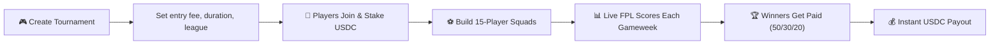
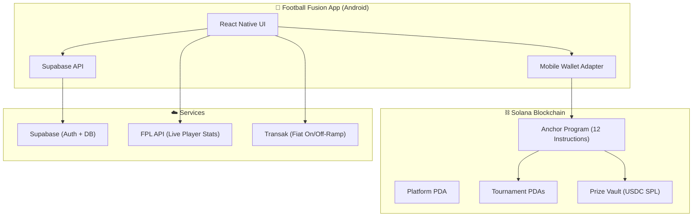

# ⚽ Football Fusion — Pitch Deck

## The Problem

**3.5 billion football fans. $22B+ fantasy sports market. And it's fundamentally broken.**

Traditional fantasy football — led by FPL, FanDuel, and DraftKings — forces users into a broken model:

| What's Broken | Reality |
|--------------|---------|
| 🏢 **Company controls your money** | Platforms hold all funds, decide payouts, and skim 15-20% |
| 📅 **Seasonal lock-in** | FPL pays ONE winner at the end of a 10-month season. Most players earn nothing. |
| ⏳ **Wait forever to get paid** | Withdrawals take 3-7 days through restrictive payment rails |
| 🌍 **League-locked** | Stuck playing one league. Season ends? Come back in 4 months. |
| � **No user control** | You can't create your own tournaments, set your own stakes, or choose your own rules |

> **The result?** 90%+ of fantasy managers play all season and earn absolutely nothing. The house always wins.

---

## The Solution

**Football Fusion is PvP fantasy football where players — not corporations — control the game.**

Users create their own tournaments, set their own entry fees, and compete head-to-head for transparent prize pools that pay out **weekly or monthly** — not at the end of a 10-month season.

### How It's Different

| Traditional Fantasy | **Football Fusion** |
|--------------------|--------------------|
| Company-owned tournaments | **User-created** — you set the rules, stakes, and duration |
| One winner at season's end | **Weekly/monthly payouts** — earn as you play |
| Single league (EPL only) | **Multi-league** — Premier League, La Liga, Serie A, and more |
| Seasonal (Sep–May) | **Year-round** — always a league in season somewhere |
| Opaque, company-held prize pools | **Transparent on-chain pools** — every dollar verifiable |
| 15-20% platform rake | **3% fee** — 97% goes directly to winners |

---

## How It Works



### Core Mechanics

| Feature | Details |
|---------|---------|
| 🏟️ **Create Tournaments** | Any user can create — set entry fee (USDC), max players, duration, league |
| � **Flexible Duration** | 1 week, 1 month, or custom — earn on YOUR schedule |
| 🌍 **Multi-League** | Premier League today, La Liga & Serie A coming — play year-round |
| � **PvP Competition** | Small groups (2-64 players) — no competing against millions |
| 💰 **Instant Payouts** | USDC paid directly to your wallet — no withdrawal delays |
| � **Real Player Data** | Powered by live FPL stats — real performances, real stakes |
| 💳 **Easy On/Off-Ramp** | Buy USDC with card/bank, cash out to bank account |

---

## Why This Wins

### 🎯 Stickiness & Engagement

Unlike seasonal fantasy that dies in May, Football Fusion creates **continuous engagement loops**:

1. **Weekly payouts** → Check scores every gameweek, instant reward cycle
2. **Multi-league** → EPL ends? La Liga finals still running. Always a tournament live
3. **User-created tournaments** → Friends challenging friends, community leagues, rivalries
4. **Financial stakes** → Every gameweek matters when real money is on the line
5. **Short-form competitions** → 1-week sprints for casual players, monthly for hardcore fans

> **The result:** An always-on fantasy platform that pays you every week, not once a year.

### 🎯 Product-Market Fit

| Segment | Size | Pain Point We Solve |
|---------|------|-------------------|
| **FPL Players** | 11M+ active | Play all season, earn nothing — want stakes |
| **Casual Fans** | Hundreds of millions | 10-month commitment is too long — want short tournaments |
| **Multi-League Fans** | Growing | Follow La Liga AND EPL — want one app for all |
| **Emerging Markets** | Africa, SEA, LATAM | Can't access FanDuel — need USDC + crypto rails |

---

## Architecture



### Solana Integration

| On-Chain Action | What Happens |
|----------------|-------------|
| **Create Tournament** | PDA created with entry fee, duration, cap. Prize vault initialized |
| **Join Tournament** | USDC transferred to prize vault. Team + stats recorded on-chain |
| **Distribute Prizes** | 50/30/20 split via PDA signer. Winner stats updated on-chain |
| **Verify Anything** | Every tx visible on Solana Explorer — full transparency |

---

## Business Model

```
Entry Fee → 97% Prize Pool + 3% Platform Fee
            ↓                    ↓
     Top 3 Winners (USDC)  Platform Revenue
     50% / 30% / 20%       (All on-chain, verifiable)
```

| Metric | Year 1 Projection |
|--------|-------------------|
| Active Users | 10,000 managers |
| Avg Entry Fee | 5 USDC |
| Tournaments/Week | 50 |
| Weekly Volume | 250,000 USDC |
| Platform Revenue | ~7,500 USDC/week |
| Annual Revenue | ~390,000 USDC |

---

## Competitive Landscape

| | FPL | FanDuel | Sorare | **Football Fusion** |
|---|-----|---------|--------|---------------------|
| **Who creates tournaments?** | Company | Company | Company | **Anyone** |
| **Payout frequency** | End of season | Per contest | Per card sale | **Weekly/Monthly** |
| **Payout transparency** | None | None | Partial | **100% on-chain** |
| **Platform fee** | N/A | 15-20% | Hidden | **3%** |
| **Multi-league** | EPL only | US sports | Multi | **Multi-league** |
| **Year-round?** | ❌ Seasonal | ✅ | ✅ | ✅ **Always on** |
| **Mobile-native** | ✅ | ✅ | ❌ Web | ✅ **Built for Seeker** |
| **Global access** | ✅ Free | ❌ Geo-locked | ✅ | ✅ **USDC + Transak** |

---

## Tech Stack

| Layer | Technology |
|-------|-----------|
| **Mobile** | React Native + Expo (SDK 53) — native Android APK |
| **Blockchain** | Solana (Anchor Framework, SPL Token, USDC) |
| **Wallet** | Mobile Wallet Adapter (MWA) — Seeker compatible |
| **Backend** | Supabase (Auth, Postgres, Realtime) |
| **Player Data** | Fantasy Premier League API (live stats) |
| **On/Off-Ramp** | Transak (card/bank ↔ USDC) |

---

## Roadmap

| Phase | Timeline | What Ships |
|-------|----------|-----------|
| ✅ **MVP** | Now | Tournament create/join, team builder, USDC stakes, leaderboards, wallet |
| 🔜 **v1.1** | Month 2 | Push notifications, gameweek reminders, social sharing |
| 📱 **v1.2** | Month 3 | Head-to-head mode, private leagues, in-app chat |
| 🌍 **v2.0** | Month 4-5 | La Liga, Serie A, Bundesliga — true year-round play |
| 🏆 **v3.0** | Month 6+ | Season passes, NFT rewards, community governance |

---

## Team

| Role | Expertise |
|------|-----------|
| **FonioLabs** | Full-stack Web3 development, Solana smart contracts, mobile-first dApps |

---

## Summary

> **Fantasy football is a $22B market controlled by corporations that pay one winner a year.**
>
> **Football Fusion puts the power back in the players' hands.**
>
> Create your own tournaments. Set your own stakes. Get paid every week.  
> Play across leagues. Play year-round. Every dollar transparent on-chain.
>
> **PvP fantasy football — owned by the players, not the platform.**

---

**🔗 Links**
- GitHub: [github.com/foniolabs/football-fusion-mobile](https://github.com/foniolabs/football-fusion-mobile)
- Program: [5AaoN6kBmNoEqTiNPaV2y1am9QrEEHwgRHneR1QNExLm](https://explorer.solana.com/address/5AaoN6kBmNoEqTiNPaV2y1am9QrEEHwgRHneR1QNExLm?cluster=devnet)
- Platform TX: [Solana Explorer](https://explorer.solana.com/tx/7CC1wMzhkf2xfFUfThzvkThxWjAkmSU7RH9XHbnztWUBrqWxRdf2gk76CKg1y3y2ziZkK6rbJ8JGWVkZMThu9TZ?cluster=devnet)
